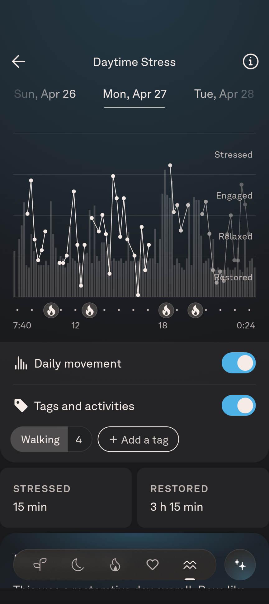

# Relax -- Oura Stress Data Extractor

A small web app that turns a screenshot of Oura’s **Daytime Stress** screen into a table of `(timestamp, stress zone)` rows. Oura provides no API for this data, so the extractor reconstructs it directly from the screenshot using OpenCV and Tesseract OCR.

> Extracted from the larger (unreleased) _daystar_ project as a standalone, shareable tool. The extraction core (`backend/app/extractor/`) is vendored from daystar’s `extractor/` package.

## Try it out

https://relax.codeome.net

## Screenshots

### Upload & Extract
Drop in a Daytime Stress screenshot, set the date, and click **Extract**.


### Original + Annotated Views
The extractor displays the original screenshot alongside an annotated version showing detected data points.


### Results Table
Every detected datapoint is reconstructed into a clean table.  
Click **Download CSV** to save the results.


## Device Compatibility

|Device|Resolution|Status|
|---|---|---|
|iPhone SE (2020)|640×1136|Supported|
|Google Pixel 9|864×1939|Supported|
|Others|—|Need screenshots|

Example Pixel 9 Daytime Stress screenshot (a supported input):



## Contribute a Screenshot (Help Add Device Support)

If your device isn’t supported, you can help by contributing a screenshot.

1. Open an issue titled “Device screenshot: <your device>”.
2. Attach your Daytime Stress screenshot.
3. Include your device model and resolution if known.

This helps expand support to more devices.

## How it works

1. **Mask** the chart to remove the zone labels ("Stressed", "Engaged", …).
2. **Detect dots** with `cv2.HoughCircles`.
3. **OCR the x-axis** time labels to anchor the chart's start/end times.
4. Map each dot's x-position to a 15-minute timeslot → timestamp, and its
   y-position to a stress zone.

### ⚠️ Fixed-resolution assumption

All the pixel geometry (dot x-range, crop bounds, OCR regions, the bundled mask)
is resolution-specific and lives in a `DeviceProfile` per supported device
(currently **640×1136** iPhone SE/8 and **864×1939** Pixel 9), auto-selected by
the screenshot's dimensions. Uploads of other sizes are **rejected** rather than
silently producing a wrong table. Adding a device means adding a new
`DeviceProfile` to `_PROFILES` in `backend/app/extractor/core.py` — see the
"Contribute a Screenshot" section above.

## Documentation

See [`docs/GOVERNANCE_INDEX.md`](docs/GOVERNANCE_INDEX.md) for the full
[architecture](docs/ARCHITECTURE.md), [threat model](docs/THREAT_MODEL.md), and
[hardening roadmap](docs/HARDENING_ROADMAP.md).

## Develop Locally

**Backend** (needs Tesseract installed locally, or just use Docker):

```bash
cd backend
python -m venv .venv
source .venv/bin/activate   # Windows: .venv\Scripts\activate
pip install -r requirements.txt
uvicorn app.main:app --reload --port 8000
```

**Frontend** (proxies `/api` → `127.0.0.1:8000`):

Requires Node.js v20.19+ or v22.12+. If your system Node is older, 
use [nvm](https://github.com/nvm-sh/nvm): `nvm install 22 && nvm use 22`.

```bash
cd frontend
npm install
npm run dev          # http://localhost:5173
```

## Tests

```bash
cd backend
python -m venv .venv
source .venv/bin/activate   # Windows: .venv\Scripts\activate
pip install -r requirements-dev.txt
pytest
```

The suite includes a **golden test** that pins the vendored core's output to the
daystar CLI's known-good result for the bundled 2026-02-10 sample, so the copy
can't silently drift. Tests run real OCR, so Tesseract must be installed
(`TESSERACT_CMD` overrides the binary path).

## Run with Docker Locally

```bash
docker compose up --build
# Caddy serves plain HTTP on http://localhost by default.
```

If Chrome keeps upgrading `http://localhost` to `https://localhost`, clear
`localhost` site data or open a fresh profile/incognito window. Chrome can cache
an HTTPS-only policy for `localhost` after earlier HTTPS testing.

## Deploy on Cloud Server

1. Point a DNS A record at the server.
2. `cp .env.example .env` and set `CADDY_SITE_ADDR` and `CADDY_TLS_SNIPPET`. Also
   set `REQUEST_LOG_SALT` (see [Request log](#request-log)) and, optionally,
   `CONTACT_EMAIL` for the footer "Contact" link.
3. `docker compose up -d --build`

> **Upgrading from a version where the containers ran as root?** The existing
> data volume is owned by root, so the now-unprivileged backend can't write its
> SQLite databases (every extraction will 500). Fix the ownership once:
> `docker compose run --rm --user root backend chown -R 1000:1000 /data`

`CONTACT_EMAIL` is baked into the frontend bundle at build time (it becomes the
`VITE_CONTACT_EMAIL` build arg), so changing it requires a `--build`. Leave it
empty to hide the link entirely — no address ships in the source either way.

Caddy terminates TLS, serves the static frontend, and reverse-proxies `/api/*`
to the backend. The site is **public and unauthenticated** — abuse is handled by
the per-IP rate limit, the in-flight cap, and Cloudflare (see below). Only
ports 80/443 are exposed; the backend and frontend containers are internal.
Caddy also sets security headers (HSTS, CSP, `nosniff`, frame denial), caps
`/api` upload bodies at 1 MB, and writes JSON access logs to stdout (`docker
compose logs caddy`). All three containers run with all Linux capabilities
dropped, and the backend and frontend run as non-root users — an exploit
against the image parsers (OpenCV/Tesseract) lands in an unprivileged process.

> The CSP pins the one inline `<script>` in `frontend/index.html` by SHA-256 hash.
> If you change that snippet, regenerate the hash and update it in the `Caddyfile`.

### TLS modes

The compose stack supports both local and production TLS without committing any
private certs:

1. **Local default:** `CADDY_SITE_ADDR=http://localhost` and `CADDY_TLS_SNIPPET=no_tls`
   make Caddy serve the stack over plain HTTP on localhost.
2. **Production:** set `CADDY_SITE_ADDR=https://your-domain` and
   `CADDY_TLS_SNIPPET=tls_origin`, then mount your Cloudflare Origin cert/key
   into `./certs/origin.pem` and `./certs/origin-key.pem` (read-only) before
   starting the stack.

## Public deployment behind Cloudflare

For a public, unauthenticated deployment, put Cloudflare in front for free DDoS
absorption and to hide the origin IP. The per-IP daily limit (above) and the
in-flight concurrency cap protect CPU/RAM; Cloudflare handles the volumetric
layer.

1. **Add the domain to Cloudflare** and switch your registrar to Cloudflare's
   nameservers.
2. **Proxy the DNS record** — an `A` record for your domain → your server IP with
   the **orange cloud** (proxied) on.
3. **TLS.** Use the production TLS mode above with a **Cloudflare Origin
   Certificate** (Cloudflare dashboard → SSL/TLS → Origin Server) and set
   SSL/TLS mode to **Full (strict)**. The origin cert is valid for years, so
   there is no renewal burden.
4. **Lock the origin to Cloudflare.** Restrict your Cloud Server firewall so ports
   80/443 only accept Cloudflare's IP ranges
   (<https://www.cloudflare.com/ips/>); otherwise bots can hit the origin IP
   directly and bypass Cloudflare. Those same ranges are listed as
   `trusted_proxies` in the `Caddyfile` so `{client_ip}` (and the access logs and
   per-IP limit) reflect the real visitor, not the Cloudflare edge.
5. *(Optional)* Add a Cloudflare rate-limiting rule for short-burst protection;
   the 24 h per-IP quota stays in the app since the free tier can't do long
   windows.

## API

`POST /api/extract` (multipart form)

| field          | type   | notes                                  |
| -------------- | ------ | -------------------------------------- |
| `file`         | file   | PNG/JPEG screenshot, 640×1136 or 864×1939 |
| `date`         | string | `YYYY-MM-DD`, the day the chart covers |
| `include_image`| bool   | return annotated chart as base64 PNG   |

Returns `{ points, gaps, warnings, meta }` (plus `annotated_png` if requested).

`GET /api/health` → `{ "status": "ok" }`

### Limits & responses

OCR is CPU-bound, so the endpoint runs it off the event loop in a worker thread
and caps how much work is in flight at once:

| status | when                                                           |
| ------ | -------------------------------------------------------------- |
| `200`  | success                                                        |
| `413`  | upload larger than 1 MB (also rejected at the edge by Caddy)   |
| `422`  | bad date, undecodable image, wrong/oversized resolution, no dots|
| `429`  | per-IP daily limit reached (`Retry-After` set)                  |
| `500`  | unexpected error (details are logged server-side, not returned)|
| `503`  | server busy — too many extractions in flight (`Retry-After: 60`)|
| `504`  | a single extraction exceeded the timeout                        |

Env vars tune the throttle (defaults in parentheses):

| var                         | meaning                                          |
| --------------------------- | ------------------------------------------------ |
| `MAX_CONCURRENT_EXTRACTIONS`| OCR jobs running at once (`2`)                    |
| `MAX_INFLIGHT_EXTRACTIONS`  | running + queued before `503` (`6`)               |
| `EXTRACT_TIMEOUT_SECONDS`   | per-extraction timeout before `504` (`30`)        |
| `RATE_LIMIT_MAX`            | successful extractions per IP per window; `0` off (`10`)|
| `RATE_LIMIT_WINDOW_HOURS`   | rolling window for the per-IP limit (`24`)        |
| `RATE_LIMIT_DB`             | SQLite path for the counter (`/data/ratelimit.db` in Docker)|

Only **successful** (200) extractions count against `RATE_LIMIT_MAX`; the count
is keyed on the client IP (from the `X-Real-IP` header Caddy sets) and persists
in SQLite, so it survives restarts and redeploys.

## Request log

Every request — served *or* rejected — is appended to a durable SQLite log
(separate from the rate-limit DB, which prunes itself). Each row is:

| column          | meaning                                            |
| --------------- | -------------------------------------------------- |
| `ts`            | ISO8601 UTC timestamp                              |
| `ip_hash`       | `SHA256(REQUEST_LOG_SALT + client_ip)` — no raw IP |
| `processing_ms` | wall-clock time to handle the request              |
| `status`        | HTTP status returned                                |
| `success`       | `1` if `status < 400`, else `0`                     |
| `error`         | failure detail (nullable)                          |

Raw IPs are never stored; they're hashed with a server-side salt so repeat
visitors can be correlated without keeping PII.

| var                | meaning                                                       |
| ------------------ | ------------------------------------------------------------- |
| `REQUEST_LOG`      | `0` disables logging entirely (on by default)                 |
| `REQUEST_LOG_DB`   | SQLite path for the log (`/data/requests.db` in Docker)       |
| `REQUEST_LOG_SALT` | salt for hashing IPs — **keep constant across restarts**, or repeat-visitor correlation breaks; never commit the real value |

Generate a salt once and put it in `.env`:

```bash
python -c "import secrets; print(secrets.token_hex(16))"
```

### Reading the log

There is **no admin HTTP endpoint** (the service has no auth by design). Inspect
the log out-of-band with the read-only dump CLI, which emits CSV (newest first):

```bash
python -m app.logdump                 # CSV to stdout
python -m app.logdump --limit 100     # only the 100 most recent rows
python -m app.logdump --out log.csv   # write to a file
```

Under Docker the log lives in the `ratelimit_data` volume *inside the backend
container* (`/data/requests.db`), so run the dump there and copy the file out:

```bash
docker compose exec backend python -m app.logdump --out /data/dump.csv
docker compose cp backend:/data/dump.csv ./dump.csv
```

## License

MIT — see [LICENSE](LICENSE).
